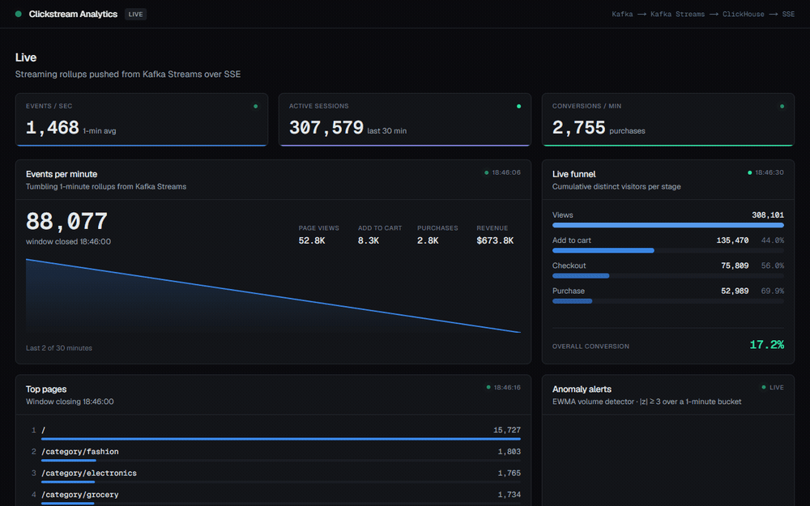
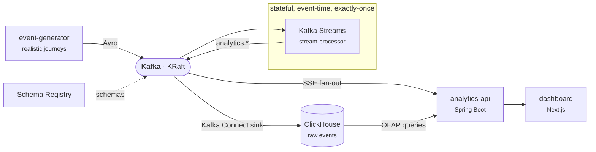

# Real-Time Clickstream Analytics Pipeline

[](https://github.com/AryamannSingh7/realtime-clickstream-analytics/actions/workflows/ci.yml)

A production-minded, end-to-end **real-time analytics pipeline** that ingests a high-volume clickstream, processes it with **stateful, windowed stream operations**, stores results in a **columnar OLAP store**, and surfaces them on a **live dashboard** — all containerized and runnable with a single command.



*Unedited capture at ~1,500 events/sec. Gauges and the live funnel update every 3s off the
SSE stream; the per-minute panel refreshes as each tumbling window closes — note the sparkline
gaining a point and the top-pages ranking reordering mid-clip.*

> **Status:** ✅ Feature-complete (P0–P8). The full pipeline runs end-to-end from one
> `docker compose up`; performance is measured and written up in
> [`docs/benchmarks.md`](docs/benchmarks.md).

**Measured on a single 16-thread laptop** ([full methodology + hardware](docs/benchmarks.md)):

| | |
|---|---|
| Sustained end-to-end throughput | **≈ 18–20k events/sec** (generator itself sustains 55k) |
| Ingest latency, produced → queryable | **p95 301–418 ms**, p50 ~200 ms |
| OLAP over **10M** rows | all dashboard queries **sub-second** — `windowFunnel` 708 ms, `uniqCombined` 85 ms |

The throughput ceiling is the stateful exactly-once processor and the ClickHouse sink
competing for the same cores — not the producer or the ingest path. That's the honest
number for one box, and [the write-up explains why](docs/benchmarks.md#throughput).

---

## Why this project

Most "analytics" demos are batch jobs in disguise. This one is genuinely **streaming**: events are aggregated *as they arrive* using event-time windows, sessionization, and stateful pattern detection — the same techniques that power real product-analytics platforms (think Mixpanel / Google Analytics, in real time).

It's built to demonstrate **data-engineering and stream-processing depth**:

- **Event-time processing** with watermarks and late-event handling
- **Sessionization** via session windows (30-minute inactivity gap)
- **Windowed aggregations** — per-minute rollups and live top-N
- **Stateful processing** — real-time conversion funnels and anomaly/spike detection
- **Stream–table joins** for event enrichment
- **Exactly-once semantics** end-to-end
- A clean separation of concerns: **stream processing for low-latency rollups, columnar OLAP for heavy funnel/retention queries**

## Architecture (at a glance)



The two read paths are deliberate: **Kafka Streams serves low-latency rollups**
(sessions, per-minute metrics, top-N, live funnel, alerts) pushed to the UI over SSE, while
**ClickHouse serves heavy ad-hoc OLAP** (funnel, retention, unique visitors) on demand.

Full write-up in [`docs/architecture.md`](docs/architecture.md); the reasoning behind each
choice is in the [ADRs](docs/decisions/).

## Tech stack

| Layer | Technology | Why |
|---|---|---|
| Transport | **Apache Kafka** (KRaft) | High-throughput, replayable event log |
| Schema | **Avro + Schema Registry** | Schema enforcement & evolution |
| Stream processing | **Kafka Streams** (Java 17) | Stateful, event-time streaming with exactly-once + Interactive Queries |
| Storage | **ClickHouse** | Columnar OLAP built for clickstream; native `windowFunnel` / `uniqCombined` |
| Serving | **Spring Boot** (SSE + ClickHouse queries) | Live push to the UI + OLAP API |
| Dashboard | **Next.js + React** | Live-updating analytics views |
| Infra | **Docker Compose** | One-command, fully reproducible local stack |
| CI | **GitHub Actions** | Build, unit + integration tests (Testcontainers), dashboard lint/build, compose validation |

Everything in the stack is **free and open-source** — no paid services required to run it.

## Roadmap

- [x] **P0** — Scaffolding & infra (Kafka, Schema Registry, ClickHouse via Docker Compose)
- [x] **P1** — Ingestion: realistic event generator → Kafka → ClickHouse (Kafka Connect sink)
- [x] **P2** — Streaming core: per-minute metrics + windowed top-N
- [x] **P3** — Sessionization + conversion funnel + enrichment joins
- [x] **P4** — Stateful anomaly / spike detection
- [x] **P5** — Serving API (SSE live feeds + ClickHouse OLAP endpoints)
- [x] **P6** — Live Next.js dashboard
- [x] **P7** — Load harness & benchmarks (throughput / latency / lag / OLAP / scaling)
- [x] **P8** — Polish: docs, architecture diagram, integration tests, CI, demo recording

## Getting started

**Prerequisites:** Docker Desktop, JDK 17. (Maven not required — a wrapper is included.)

```bash
# 1. Bring up the entire stack and build the service images.
docker compose up -d --build

# 2. Open the live dashboard — this is the payoff.
#    Give it ~1-2 min: windowed rollups only appear once their first window closes.
open http://localhost:3000        # or just browse to it
```

That's it. On `up`, the **event-generator** starts producing a realistic Avro clickstream to
`clickstream.events.raw`; the **stream-processor** computes sessions, per-minute metrics,
top-N pages, a live funnel and anomaly alerts; the **ClickHouse Kafka Connect sink**
(auto-registered by the `register-connector` job) lands raw events in `analytics.events`; and
the **dashboard** renders both the live SSE feeds and the OLAP views.

> **A note on what you'll see first.** Live tiles (active sessions, funnel) update within
> seconds. The per-minute rollups and top-N are **~60s behind by design** — Kafka Streams
> suppression holds each window until it closes so it emits exactly once. That delay is a
> correctness guarantee, not lag; see [benchmarks](docs/benchmarks.md#methodology).

```bash
# Verify the wiring end-to-end
bash scripts/smoke-test.sh

# Watch raw events land in ClickHouse (count should climb)
curl -s 'http://localhost:8123/?user=clickstream&password=clickstream' \
  --data-binary 'SELECT count() FROM analytics.events'

# Drive load at a chosen rate (see benchmarks/ for ramp + spike profiles)
cd benchmarks && ./drive-load.sh steady 5000 60
```

| Service | Endpoint |
|---|---|
| **Dashboard** | **http://localhost:3000** |
| analytics-api | http://localhost:8091 — SSE live streams + OLAP endpoints |
| Event generator | http://localhost:8089/api/generator/status — control rate / pause / resume |
| stream-processor | http://localhost:8090 — health + Prometheus metrics |
| Kafka (host) | `localhost:9092` |
| Schema Registry | http://localhost:8081 |
| Kafka Connect (REST) | http://localhost:8083 — `GET /connectors/clickhouse-sink/status` |
| ClickHouse (HTTP) | http://localhost:8123 — user `clickstream` / pass `clickstream`, db `analytics` (local dev creds) |

Tear down with `docker compose down` (add `-v` to also drop data volumes).

### Building & testing outside Docker

```bash
./mvnw -B verify                       # Avro codegen + compile + unit tests (no Docker)
./mvnw -B verify -Pintegration-tests   # + Testcontainers ITs (real Kafka/SR/ClickHouse)
```

Integration tests are opt-in behind a profile so the default build stays fast and
Docker-free; a [dedicated CI job](.github/workflows/ci.yml) runs them on every push. See
[ADR-0004](docs/decisions/0004-testing-strategy.md) for why they exist alongside the
`TopologyTestDriver` unit tests.

## Project layout

```
schemas/              # Shared Avro schemas — source of truth for event models
services/
  common/             # Avro-generated event models (shared module)
  event-generator/    # Spring Boot load generator (realistic journeys → Kafka)
  stream-processor/   # Kafka Streams topologies — sessions, metrics, top-N,
                      #   funnel, anomalies (stateful, event-time, EOS-v2)
  analytics-api/      # Spring Boot serving layer — SSE fan-out + ClickHouse OLAP
  dashboard/          # Next.js live dashboard (App Router, Tailwind, Recharts)
infra/
  clickhouse/         # ClickHouse init SQL (schema)
  kafka-connect/      # ClickHouse sink connector image + config
benchmarks/           # Load harness + capture scripts (throughput/latency/lag/OLAP/scaling)
scripts/              # Helper scripts (smoke test, etc.)
docs/                 # Architecture write-up + ADRs (decision records) + benchmark results
.github/workflows/    # CI: build + unit tests, and Testcontainers integration tests
docker-compose.yml    # One-command local stack
```

---

*Built as a portfolio project demonstrating real-time data-engineering and stream-processing.*
