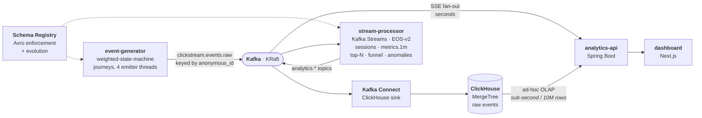

# Architecture

> Living document — expanded as milestones land. See [`decisions/`](decisions/) for the
> Architecture Decision Records (ADRs) behind the key choices.

## Goal

Ingest a high-volume clickstream, process it with **stateful, event-time stream
operations**, store results in a **columnar OLAP store**, and surface them on a **live
dashboard** — all free, all containerized, all runnable with one command.

## High-level data flow

Two read paths, chosen deliberately — see [Architectural through-line](#architectural-through-line).

## Component responsibilities

| Component | Role |
|---|---|
| **event-generator** | Synthesizes realistic e-commerce journeys (weighted state machine); configurable EPS, bursts, late events. Produces Avro to `clickstream.events.raw`. |
| **Kafka (KRaft)** | Durable, replayable event transport. |
| **Schema Registry** | Avro schema enforcement + evolution. |
| **ClickHouse** | Columnar store for raw events; serves heavy OLAP (funnel, unique visitors, retention, time-series). |
| **Kafka Connect (ClickHouse Sink)** | Exactly-once ingestion Kafka → ClickHouse; decouples ingest from query load. |
| **stream-processor (Kafka Streams)** | Low-latency streaming rollups: sessionization, per-minute metrics, windowed top-N, live funnel, anomaly detection. EOS + Interactive Queries. |
| **analytics-api (Spring Boot)** | Fans out `analytics.*` topics to the UI over SSE; exposes ClickHouse-backed OLAP endpoints. |
| **dashboard (Next.js)** | Live-updating analytics views. |

## Architectural through-line

**Kafka Streams owns low-latency streaming rollups; ClickHouse owns heavy OLAP.** Each
tool does what it is best at — a deliberate split, documented in
[ADR-0002](decisions/0002-storage-clickhouse.md).

## Topics

Names are centralized in
[`StreamTopics.java`](../services/stream-processor/src/main/java/com/clickstream/processor/topology/StreamTopics.java)
so the wiring and its tests cannot drift apart.

| Topic | Purpose | Notes |
|---|---|---|
| `clickstream.events.raw` | Source event stream | Avro, keyed by `anonymous_id` (per-user ordering for sessionization) |
| `ref.products` | Product dimension | Compacted; consumed as a **GlobalKTable** for enrichment |
| `clickstream.events.enriched` | Events + product attributes | Output of the enrichment join |
| `analytics.sessions` | Completed session summaries | Session windows, 30-min inactivity gap |
| `analytics.metrics.1m` | Per-minute rollups | 1-min tumbling windows, 5s grace, suppressed |
| `analytics.topn.pages.1m` | Top-N pages per minute | Windowed top-N, suppressed |
| `analytics.funnel.live` | Live cumulative funnel | Stateful; wall-clock punctuator |
| `analytics.active.sessions` | Live active-session count | Stateful; wall-clock punctuator |
| `analytics.alerts` | Anomaly / spike alerts | Stateful EWMA baseline |

> `ref.campaigns` is created by the compose bootstrap as a compacted topic but is **not
> currently consumed** — campaign attributes ride on the event itself rather than through a
> join. It is reserved for a second enrichment source.

### Windowing constants

| Constant | Value | Meaning |
|---|---|---|
| `WINDOW_SIZE` | 1 min | Tumbling window every rollup is computed over |
| `WINDOW_GRACE` | 5 s | Lateness allowed before a window closes |
| `SESSION_INACTIVITY_GAP` | 30 min | Silence that ends a visitor's session |
| `SESSION_GRACE` | 1 min | Lateness allowed before a closed session emits |

## Delivery semantics

The stream-processor runs **`exactly_once_v2`**. Kafka Streams commits its consumer
offsets, its state-store changelog writes, and its output records in a single transaction,
so a crash mid-window cannot double-count a rollup or lose one. The ClickHouse sink is a
separate consumer group with its own exactly-once delivery, which is why the two paths can
lag independently (visible in the [benchmarks](benchmarks.md#consumer-lag): after a
deliberate overload the sink drained in seconds while the stateful processor took minutes).

**Emission timing is a correctness choice, not latency.** Windowed rollups use
`suppress(untilWindowCloses(...))` so each window emits exactly one final record instead of
a stream of intermediate updates — which means they become visible ≈ one window length +
grace after event time. Live tiles that need immediate feedback (funnel, active sessions)
bypass windowing entirely and emit from a wall-clock punctuator instead. The dashboard
therefore mixes two update cadences by design.

## Performance characteristics

Measured in [`benchmarks.md`](benchmarks.md); the architectural takeaways:

- **The pipeline sustains ≈ 18–20k eps** end-to-end on a single 16-thread machine, while the
  generator alone reaches 55k. The bound is **stateful EOS processing plus the ClickHouse
  sink competing for the same cores** — not the producer, the broker, or the ingest path.
- **Ingest latency p95 stays sub-second** (301–418 ms) inside that envelope.
- **Adding stream-processor replicas on one box does not raise throughput.** Scaling to
  2 and 3 instances left throughput pinned at the same core-bound ceiling and only added
  rebalance and state-restore variance. The mechanism works correctly — the group grows,
  Kafka Streams redistributes tasks — but there is no spare compute to exploit. The topology
  is shared-nothing and coordinates purely through the consumer group, so it *is*
  horizontally scalable by construction; realizing a gain needs more **nodes**, which one
  laptop cannot provide.

One nuance worth noting: Kafka Streams balances **tasks**, not raw partitions, and its
high-availability assignor deliberately keeps warm stateful tasks where they are rather than
pay a restore cost. On a single box the six stateful source tasks therefore tend to stay
co-located even as instances join.

## Storage schema

See [`infra/clickhouse/init/01-schema.sql`](../infra/clickhouse/init/01-schema.sql).
`analytics.events` is a `MergeTree` partitioned by day, ordered by
`(event_type, event_time, anonymous_id)`.

That sort key is what makes the top-pages query cheap: leading with `event_type` lets
ClickHouse prune straight to `page_view` rows, so it scans 4.1M rows instead of 10M
([benchmarks](benchmarks.md#olap-query-latency-10m-rows)). Nested Avro (`device.*`, `geo.*`)
is flattened to `*_` columns on ingest via a Connect Flatten SMT — see
[ADR-0003](decisions/0003-clickhouse-ingestion-kafka-connect.md).

## Testing

Two layers, deliberately split — rationale in
[ADR-0004](decisions/0004-testing-strategy.md):

| Layer | Tool | Runs | Covers |
|---|---|---|---|
| Unit | `TopologyTestDriver`, mocked `JdbcTemplate` | every build, no Docker | Topology logic, windowing, aggregation math |
| Integration | Testcontainers (real Kafka + Schema Registry + ClickHouse) | `-Pintegration-tests` | Real Avro over Schema Registry, EOS-v2 across a broker, wall-clock punctuators, SQL against a real ClickHouse |

Integration tests are opt-in behind a Maven profile so the default build stays fast and
Docker-free; [CI](../.github/workflows/ci.yml) runs both as separate jobs.
